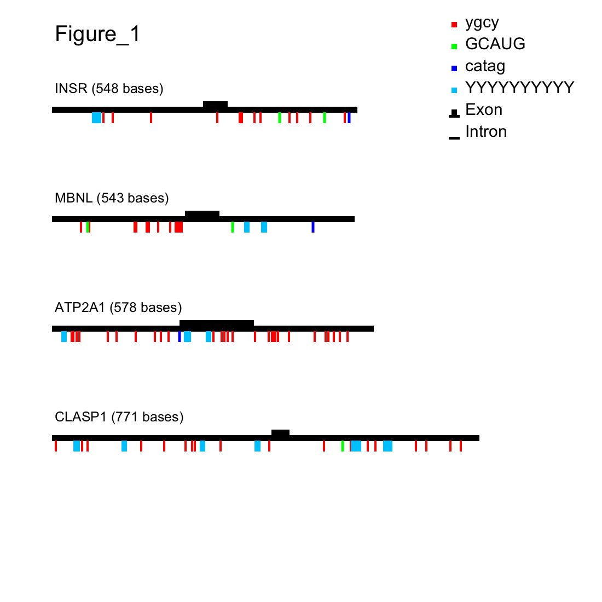

# Motif Mark

Pre-mRNA transcripts are transcribed from DNA and must undergo processing in order to create messenger RNA. The processing step this project is most concerned with is **splicing**, where sections of introns (non-coding portions of the transcript) are removed, and the adjacent exons are then attached back together. 

More specifically, transcripts can undergo **alternative splicing** where exons are selected to be retained by the transcript while others are not. This can lead to different mature mRNA molecules from the same transcript depending on the exons kept.

This splicing decision is made in part by **splicing factors**, proteins that bind to motifs in pre-mRNA and determine how it will be spliced.

Due to this, visualizing the location of specific motifs that these proteins bind to can potentially help explain how splicing events are being regulated in transcripts. 


## motif-mark-oop.py

This Python script takes a FASTA file containing transcript reads and a text file containing motif sequences as input. 

Within the FASTA file, introns are denoted with lowercase letters while exons are shown as uppercase. 

The final output is a png image visualizing the location of each motif on each transcript. Introns are shown as a black line spanning the length of the sequence, and exons are visualized as black rectangles above the sequence line. Motifs are lines drawn underneath the sequence line, with the respective color of the line designating which motif is at that position. The legend shows which colors correspond to which motif in the motif file. 
## bioinfo_functions.py

This module contains several helpful functions to be used to solve bioinformatics problems. Specifically, for this project it contains the function ```oneline_fasta```, which converts a FASTA file into two lines for each read: a header line and a sequence line. This module must be in the same directory as motif-mark-oop.py for that script to run. 
## Usage/Examples

To use the code in this repository, pycairo must be installed in a conda environment, and that environment must be activated. 

Then the script motif-mark-oop.py can be run on the command line with two required arguments.


### Creating a Conda Environment / Installing Pycairo

Create a conda environment.

```
conda create -n <pycairo_environment_name>
```

Then activate the conda environment just made:

```
conda activate <pycairo_environment_name>
```

Install pycairo into the conda environment.
```
conda install -c conda-forge pycairo
```

This conda environment must be activated for the motif-mark-oop.py to work. 


### Running motif-mark-oop.py

The script [motif-mark-oop.py](motif-mark-oop.py) has two required arguments to run. These are detailed in the table below.


| Argument | Input |
---------|--------
| -f | The FASTA file with sequences to screen for motifs |
| -m | The text file containing motifs |

Example using the files in folder run_examples: 

```
./motif-mark-oop.py -f run_examples/Figure_1.fasta -m run_examples/Fig_1_motifs.txt
```
This will create 3 new files in the directory the script is located:

1. A file with the suffix '.fasta.oneline'
* This is a FASTA file containing the same sequences as the input FASTA file. However, each read is converted to two lines: a header line and a sequence line. 

2. A .svg file
* This is the file in which the pycairo surface is created from in order to create our image.

3. A .png file
* This is the final output file of the image visualizing the location of all motifs in relation to the exon(s) of each transcript in the input FASTA file. 

The final image output from running the command above is shown below.



